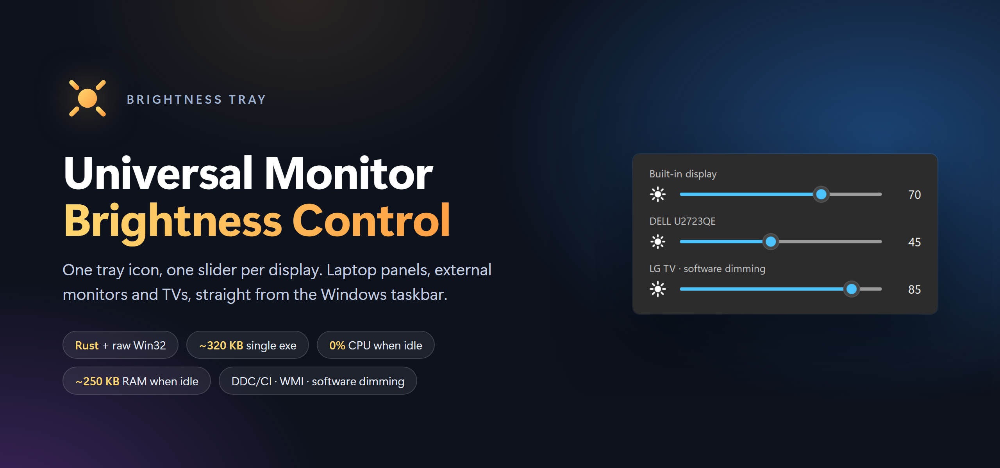
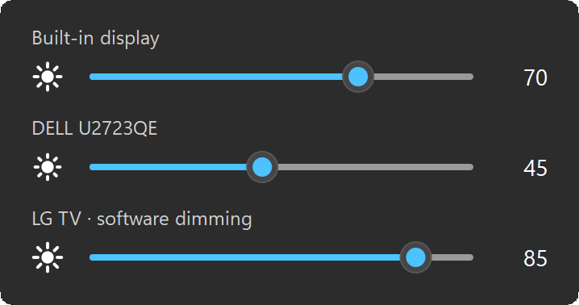
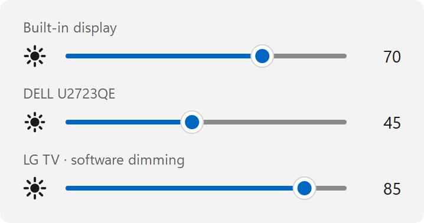
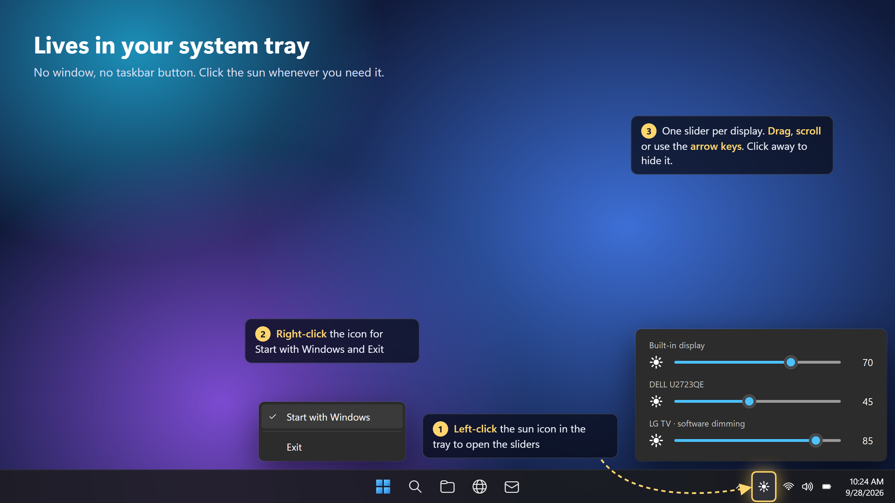
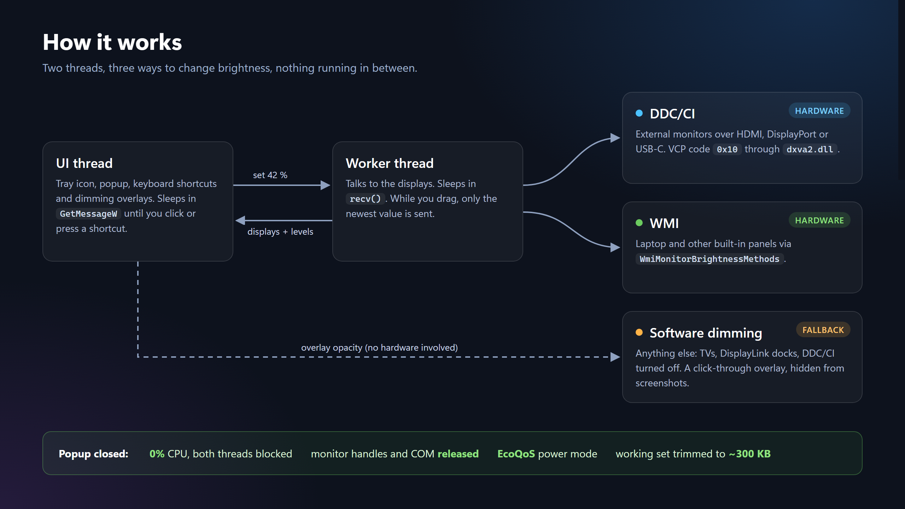

<p align="center">
  
</p>

<p align="center">
  <a href="https://github.com/PriyanshuGeTRekT/Universal-Monitor-Brightness-control/releases/latest"></a>
  <a href="https://github.com/PriyanshuGeTRekT/Universal-Monitor-Brightness-control/releases"></a>
  
  
  <a href="LICENSE"></a>
</p>

A tiny Windows tray app that controls the brightness of **every** display you
plug in: laptop panels, external monitors and TVs. Click the sun in the tray,
drag a slider, done. It is a single ~330 KB exe with no installer, no runtime
and no background work. When the popup is closed it uses 0% CPU and about
250 KB of RAM.

## Download

**[⬇ Download BrightnessTray.exe](https://github.com/PriyanshuGeTRekT/Universal-Monitor-Brightness-control/releases/latest/download/BrightnessTray.exe)**
from the [latest release](https://github.com/PriyanshuGeTRekT/Universal-Monitor-Brightness-control/releases/latest) and run it. That's it.

Requires 64-bit Windows 10 (1903 or newer) or Windows 11. It is developed and tested on Windows 11.

> The exe is not code-signed, so Windows SmartScreen may say *"Windows protected
> your PC"* the first time. Click **More info → Run anyway**. You can also
> [build it yourself](#build-from-source) from this source.

## Screenshots

<table>
  <tr>
    <td align="center"><br><sub>Dark mode</sub></td>
    <td align="center"><br><sub>Light mode</sub></td>
  </tr>
</table>

The popup follows your Windows theme and accent colour, and sits in the corner
next to the taskbar like the built-in Windows 11 flyouts. There is one slider
per display, and the sun icon grows its rays as you raise the brightness.

<p align="center">
  
</p>

## Works with every display

Each display is matched to the best method it supports:

| Display | Method | What happens |
| --- | --- | --- |
| Laptop / built-in panel | **WMI** (`WmiMonitorBrightnessMethods`) | Real backlight change, same as the brightness keys |
| External monitor (HDMI, DisplayPort, USB-C) | **DDC/CI** (VCP code `0x10`) | Real backlight change, same as the monitor's own menu |
| Anything else: TVs, DisplayLink docks, projectors, monitors with DDC/CI off | **Software dimming** | A click-through dark overlay on that screen, hidden from screenshots and screen sharing |

Displays that fall back to software dimming are labelled
*"· software dimming"* in the popup. At 100% the overlay is destroyed
completely, so it costs nothing when unused.

## Features

- **Every display at once.** Laptop panel, external monitors and TVs, each with its own slider.
- **Lives in the system tray.** Left-click the sun to open, click anywhere else (or press `Esc`) to close. Closing never quits the app.
- **Start with Windows.** Right-click the icon and tick *Start with Windows*. It starts silently in the tray at logon.
- **Mouse, wheel and keyboard.** Drag, scroll over a slider, or use `←` `→` `↑` `↓`, `PgUp`/`PgDn`, `Home`/`End` and `Tab`.
- **Native Windows 11 look.** Rounded corners, dark and light theme, your accent colour, sharp at any DPI.
- **Smooth dragging.** Only the newest value is sent to the monitor, so slow DDC/CI monitors never lag behind the slider.
- **Single instance.** Launching it again just opens the popup of the running copy.
- **Hot-plug aware.** Displays are re-detected every time the popup opens.

## Tiny footprint

Measured on Windows 11 with the popup closed:

| | |
| --- | --- |
| Exe size | **~330 KB** (one file, no DLLs, no runtime) |
| CPU while idle | **0 ms** over 15 s (both threads are blocked, no timers, no polling) |
| Memory while idle | **~250 KB** working set |
| Power mode | Runs under **EcoQoS** (efficiency mode) whenever the popup is hidden |

## How it works

<p align="center">
  
</p>

- **Built on:** Rust with the [`windows`](https://crates.io/crates/windows) crate, calling Win32 directly. There's no GUI framework: the popup is drawn by a ~100-line anti-aliased software rasteriser plus GDI text.
- **UI thread:** tray icon, popup and software-dimming overlays. It sleeps in `GetMessageW`.
- **Worker thread:** enumerates displays and talks DDC/CI (`dxva2.dll`) and WMI (`root\WMI`), which can block for tens of milliseconds per call. It sleeps in `recv()`.
- **When the popup closes:** all monitor handles and COM objects are released, the working set is trimmed and the process switches to EcoQoS.

## Usage

| Action | How |
| --- | --- |
| Open the sliders | Left-click the sun icon in the tray |
| Close | Click anywhere else, or press `Esc` |
| Change brightness | Drag, mouse wheel, or arrow keys (`Shift`+`Tab` / `Tab` switches display) |
| Start with Windows | Right-click the icon → **Start with Windows** |
| Quit | Right-click the icon → **Exit** |

> **Tip:** Windows 11 puts new tray icons under the **^** overflow arrow. Drag
> the sun onto the taskbar to keep it one click away.

## Install

The downloaded exe runs from anywhere. To install it for your user account
(`%LOCALAPPDATA%\Programs\BrightnessTray`) and turn on *Start with Windows*
in one go, build it and run:

```powershell
.\build.ps1
.\install.ps1
```

To remove it again, run `.\uninstall.ps1`. If you used the downloaded exe,
untick *Start with Windows* and delete the file.

## Build from source

You only need [rustup](https://rustup.rs). Either toolchain works:

```powershell
# GNU toolchain: no Visual Studio needed. build.ps1 puts its bundled tools on PATH.
rustup default stable-x86_64-pc-windows-gnu
.\build.ps1                      # -> dist\BrightnessTray.exe

# MSVC toolchain (needs the Visual Studio C++ build tools)
cargo build --release            # -> target\release\BrightnessTray.exe
```

### Environment variables

| Variable | Effect |
| --- | --- |
| `BRIGHTNESS_TRAY_SOFTWARE=1` | Skip DDC/CI and WMI and use software dimming on every display. Useful for monitors whose DDC/CI misbehaves. |
| `BRIGHTNESS_TRAY_THEME=dark` / `light` | Force a theme instead of following Windows |
| `BRIGHTNESS_TRAY_DPI=192` | Draw the popup at a fixed DPI |
| `BRIGHTNESS_TRAY_DEMO=1` | Show three sample displays and change nothing (used for the screenshots) |

The screenshots and diagrams in `docs/images` are generated. `docs/src/capture.ps1`
captures the real popup in demo mode, and `docs/src/render.ps1` renders the
HTML sources with headless Edge.

## Troubleshooting

- **A monitor shows "· software dimming" but supports DDC/CI.** Turn on
  *DDC/CI* in the monitor's on-screen menu. Some docks and adapters don't pass
  DDC/CI through; connect the monitor directly to test.
- **Software dimming limits.** It darkens the picture but doesn't lower the
  backlight, so it doesn't save power. The mouse cursor isn't dimmed, and
  exclusive-fullscreen games may draw above the overlay.
- **The icon disappeared.** It is probably in the **^** overflow area of the taskbar.
- **It doesn't start with Windows, and isn't listed under Task Manager → Startup apps.**
  The startup entry was probably written from inside a packaged (MSIX) app,
  for example a terminal running inside a Microsoft Store app or an AI
  assistant's desktop app. Windows silently redirects those registry writes
  into the app's private container, so it never sees them at logon. To fix
  it, start `BrightnessTray.exe` by double-clicking it in File Explorer, then
  right-click the tray icon and tick **Start with Windows**.

## Project layout

```
src/main.rs      tray icon, popup window, input, software-dimming overlays
src/backend.rs   display discovery, DDC/CI, WMI (worker thread)
src/gfx.rs       anti-aliased rasteriser for the slider and the icons
build.ps1        release build into dist\
install.ps1      per-user install + Start with Windows
uninstall.ps1    remove it again
docs/            README images and the scripts that generate them
```

## License

[MIT](LICENSE) © 2026 Priyanshu Yadav
